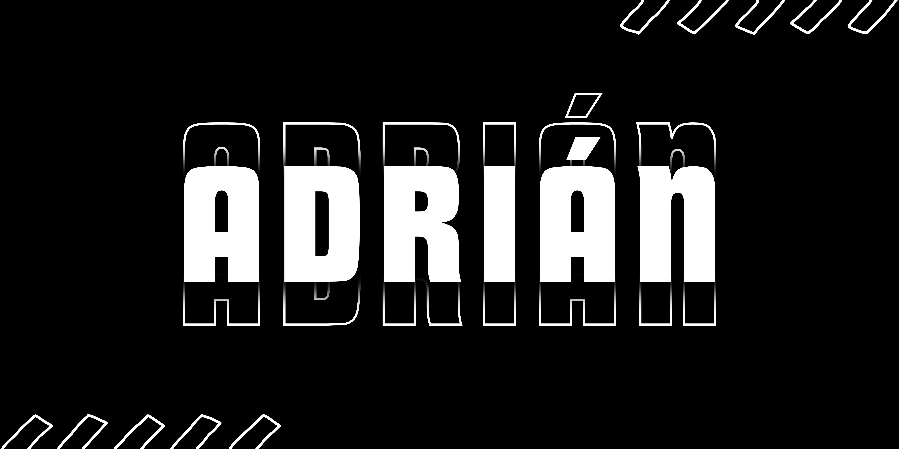

# Hola Mi nombre es Adrián

 

Soy Adrián, estudiante de Sistemas Informáticos en Red con experiencia en desarrollo web usando PHP y Python, y diseño de interfaces con HTML5 y CSS3. Tengo conocimientos en bases de datos MySQL y MongoDB, y manejo herramientas como AWS, Linux y Visual Studio Code. Además, me interesa la automatización con Arduino y el diseño gráfico y video utilizando Photoshop, Illustrator y Premiere Pro. Mi objetivo es aplicar mis habilidades en el mundo profesional de la tecnología.

### Habilidades
-----------

## Proyectos

  

-----------